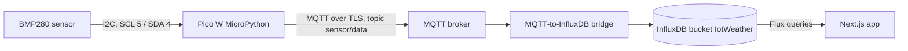

# WeatherIoT-PicoStation

Weather station on a Raspberry Pi Pico W: MicroPython firmware reads a BMP280 over I2C and publishes MQTT, data lands in InfluxDB, and a Next.js app renders current and historical readings.

## What it does

The firmware samples temperature and pressure once per second and publishes each reading as JSON to an MQTT broker over TLS. On the other end, a Next.js app queries InfluxDB directly from the browser and shows the latest reading plus 96-hour history tables for temperature and pressure.

Two details are worth a look:

- Wi-Fi provisioning fallback. If the Pico cannot join the configured network after five attempts, it flips into access-point mode (`Pico_Wifi_AP`), runs a bare `socket`-level HTTP server on port 80, and serves a form where you can submit new credentials. The POST body is parsed by hand from the raw request bytes; there is no HTTP framework on the device.
- Publish strategies. `weather_station_280.py` contains three interchangeable timer-driven modes: a reading every second (active), a reading every 60 seconds, and a batching mode that buffers 60 samples and publishes them as one payload to a separate topic (`sensor/data_collection`). Swapping modes is one line in `main()`.

## Architecture



The web app queries the measurement `mqtt_consumer`, the name Telegraf's MQTT consumer input writes by default, so a Telegraf instance (or an equivalent bridge) is expected between the broker and InfluxDB. Its configuration is not part of this repository.

## Repository layout

```
hardware/
  weather_station_280.py        Firmware entrypoint: Wi-Fi, MQTT, timers, AP fallback
  config-example.py             Template for config.py: Wi-Fi and broker credentials, topics
  libs/
    bmp280*.py                  BMP280 driver (vendored from flrrth/pico-bmp280)
    simple.py, robust.py        umqtt MQTT client (vendored from micropython-lib)
weatherapp/
  src/app/page.tsx              Latest temperature and pressure (Flux last())
  src/app/temperature/page.tsx  96 h history, 30 s mean aggregation
  src/app/pressure/page.tsx     Same for pressure
```

## Hardware

- Raspberry Pi Pico W running MicroPython
- BMP280 sensor on I2C bus 0: SCL to GPIO 5, SDA to GPIO 4, address 0x76

## Firmware setup

1. Flash MicroPython onto the Pico W.
2. Copy `hardware/config-example.py` to `hardware/config.py` and set your own values:

```python
SSID = "..."               # Wi-Fi network
PASSWORD = "..."
BROKER_ADDRESS = "..."     # MQTT broker host
BROKER_PORT = 1883
BROKER_USERNAME = "..."
BROKER_PASSWORD = "..."
MQTT_TOPIC = "sensor/data"
MQTT_TOPIC_DATA_COLLECTION = "sensor/data_collection"
```

3. Copy `hardware/` to the board (Thonny, `mpremote`, or similar) and run `weather_station_280.py`.

Behavior on the wire: payloads are `{"temperature": <C>, "pressure": <hPa>}`, values rounded to two decimals. A failed publish triggers a reconnect loop; an unrecoverable error in `main()` calls `machine.reset()` so the station restarts rather than hanging.

Note on TLS: the firmware builds an `ssl` client context with `CERT_NONE`, so the broker connection is encrypted but the broker certificate is not verified.

## Web app setup

```bash
cd weatherapp
npm install
npm run dev   # Next.js 15, Turbopack
```

Set the InfluxDB connection in the environment (for example `weatherapp/.env.local`):

```
NEXT_PUBLIC_INFLUXDB_URL=...
NEXT_PUBLIC_INFLUXDB_TOKEN=...
NEXT_PUBLIC_INFLUXDB_ORG=...
```

The bucket name (`IotWeather`) is hard-coded in the page components. Because the variables are `NEXT_PUBLIC_*` and queries run client-side, the InfluxDB token is visible to anyone who can open the page; use a read-only token scoped to this bucket.

## Pages

- `/` shows the most recent temperature and pressure, with a snow or sun icon depending on whether the temperature is below 18 C
- `/temperature` and `/pressure` list readings from the past 96 hours, averaged into 30-second windows with `aggregateWindow`

## Stack

MicroPython, umqtt, and the BMP280 driver on the device; Next.js 15 (App Router), React 19, TypeScript, Tailwind CSS, and `@influxdata/influxdb-client` in the browser.
